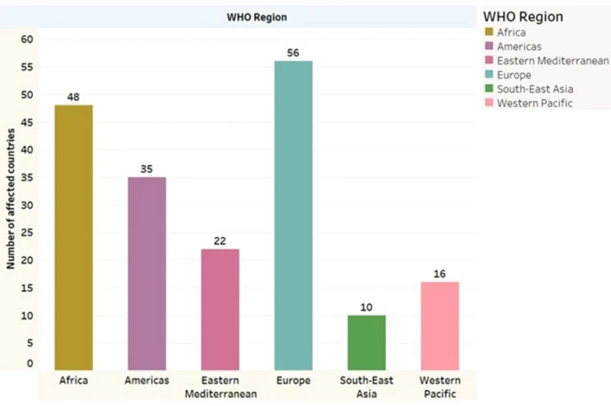
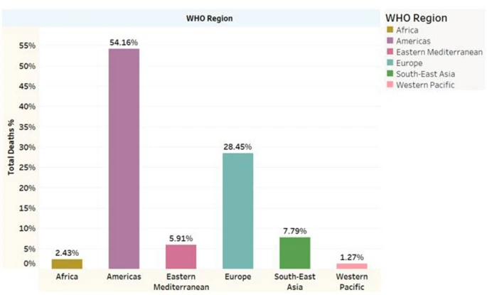
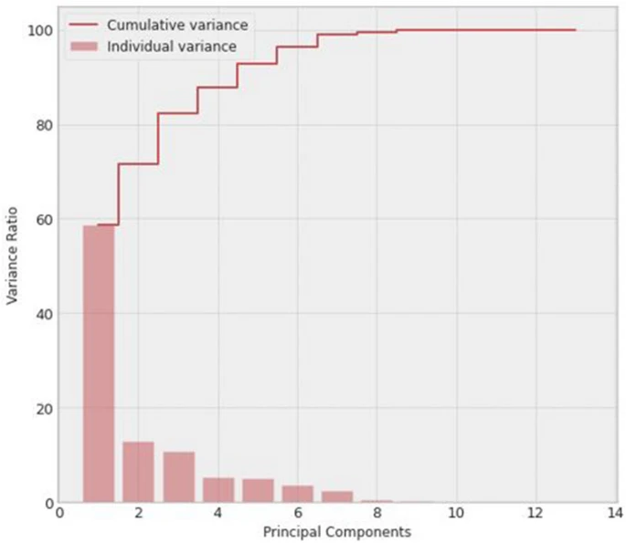
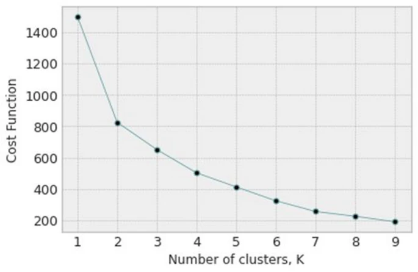
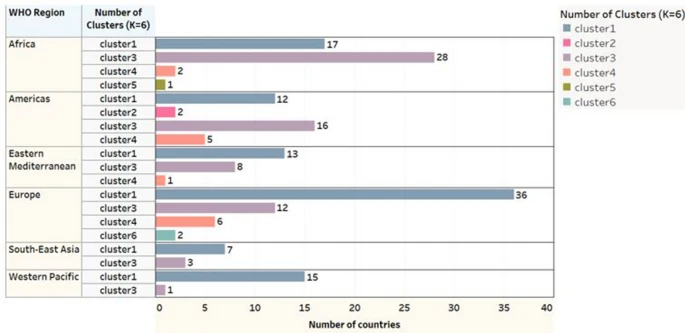
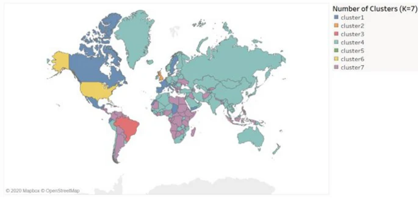
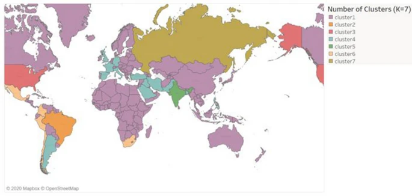
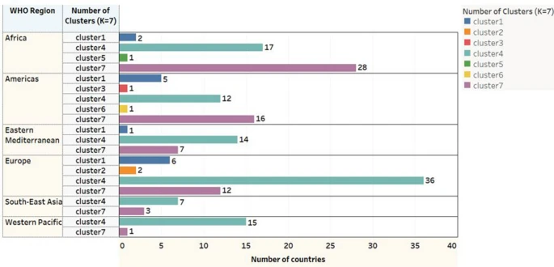

```{r document_preset, echo = FALSE, message = FALSE, warning = FALSE}
knitr::opts_chunk$set(tidy.opts = list(width.cutoff= 60), tidy = TRUE)
```

# Overview
The appendix is split into the following sections: 

* **Appendix A**: Package Loading 
* **Appendix B**: Loading and Cleaning Dataset
* **Appendix C**: Exploratory Analysis of Dataset
* **Appendix D**: Principal Component Analysis
* **Appendix E**: K-means Clustering

# Appendix A
## A.1
The following packages will be used in this analysis: 

* `readr`: Used for loading rectangular data such as `.csv` files faster than `read.csv()` from base `R`. Loads into `R` as a tibble. (`read_csv()`)
* `ggplot2`: Adds additional plotting functionality into `R`. 
* `factoextra`: For the extraction and visualization of multivariate data (specifically for PCA).
* `broom`: Package which helps convert objects from `R` to tidy tibbles. 
* `sf`: Allows for the creation of `sf` objects. 
* `countrycode`: Allows for conversion of country names to ISO3C codes. 
* `rworldmap`: Allows for the visualization of clusters in a world map. 

```{r A.1.1, message = FALSE, warning = FALSE}
# Loading packages being used. 
library(readr)
library(ggplot2)
library(factoextra)
library(broom)
library(sf)
library(countrycode)
library(rworldmap)
```

Because K-means clustering is an algorithm with random starting conditions, for consistency we will set a seed. 
```{r A.1.2}
# Setting seed for consistency of results. 
set.seed(11152000)
```


# Appendix B
First we will load this dataset into `R`. 

## B.1
```{r B.1}
# Loading the dataset into R. 
country_wise <- read_csv("country_wise_latest.csv", show_col_types = FALSE)

# Displaying names of countries.
colnames(country_wise)
```

In this dataset we have the following variables: 

* `Country/Region`: The country that the observation belongs to.
* `Confirmed`: Number of confirmed cases (accumulating over course of data collection).
* `Deaths`: Number of deaths of COVID-19 patients (accumulating over course of data collection). 
* `Recovered`: Number of patients with COVID-19 who recovered (accumulating over course of data collection).
* `Active`: Number of active cases (updated weekly).
* `New cases`: Number of new cases (updated weekly).
* `New deaths`: Number of new deaths from COVID-19 (updated weekly).
* `New recovered`: Number of new patients with COVID-19 who recovered (updated weekly).
* `Deaths / 100 Cases`: The number of deaths per 100 cases (accumulating over course of data collection).
* `Recovered / 100 Cases`: The number of recovered patients per 100 cases (accumulating over course of data collection).
* `Deaths / 100 Recovered`: The number of deaths per 100 cases (accumulating over course of data collection).
* `Confirmed last week`: Number of new cases the week prior to collection (updated weekly).
* `1 week change`: Change in number of COVID-19 cases compared to previous week (updated weekly). 
* `1 week % increase`: Change in percent of COVID-19 cases compared to previous week (updated weekly).
* `WHO Region`: The region that the country belongs to as classified by the World Health Organization. 

## B.2
We will be renaming these observations for easier indexing with `R`. 

```{r B.2}
# Renaming names of variables. 
colnames(country_wise) <- c("country", "confirmed", "deaths", "recovered", "active", "new.cases", "new.deaths", "new.recovered", "deaths100c", "recovered100c", "deaths100r", "confirmed.lastweek", "one.week.diff", "one.week.pct.inc", "who.region")
```

So the variables have been renamed as the following: 

* `Country/Region` $\rightarrow$ `country`
* `Confirmed` $\rightarrow$ `confirmed`
* `Deaths` $\rightarrow$ `deaths`
* `Recovered` $\rightarrow$ `recovered`
* `Active` $\rightarrow$ `active`
* `New cases` $\rightarrow$ `new.cases`
* `New deaths` $\rightarrow$ `new.deaths`
* `New recovered` $\rightarrow$ `new.recovered`
* `Deaths / 100 Cases` $\rightarrow$ `deaths100c`
* `Recovered / 100 Cases` $\rightarrow$ `recovered100c`
* `Deaths / 100 Recovered` $\rightarrow$ `deaths100r`
* `Confirmed last week` $\rightarrow$ `confirmed.lastweek`
* `1 week change` $\rightarrow$ `one.week.diff`
* `1 week % increase` $\rightarrow$ `one.week.pct.inc`
* `WHO Region`$\rightarrow$ `who.region`

## B.3
Let's see the first 10 observations contained within this dataset. 

```{r B.3}
head(country_wise, n = 10)
```

## B.4
Lastly, let's verify that the data is not missing any values or contains any infinite values. 

```{r B.4}
# Checking for any missing values. 
print.noquote(paste("Contains missing values:", all(is.na(country_wise))))

# Checking for infinite values. 
for(i in 1:ncol(country_wise)) {
  print.noquote(paste(paste(colnames(country_wise)[i], "contains infinite values: "), !all(!is.infinite(country_wise[[i]]))))
}
```

## B.5
We see that `deaths100r` contains infinite values. This is calculated as deaths / 100 recovered patients, which contains a country that week where none of the patients recovered. Because the authors also performed PCA and clustering on these countries, it would be inappropriate to remove these observations. We will replace these values with 0. It is incredibly unlikely that in these countries (some of which are large):

```{r B.5.1}
# Subsetting countries with infinite values in the deaths100r variable.
subset(country_wise, subset = is.infinite(country_wise$deaths100r))[, c(1, 2, 4, 11)]
```

We will now replace the observations with infinite values with 0's instead. 

```{r B.5.2}
# Replacing the infinite values with 0. 
country_wise[, 11] <- ifelse(!is.finite(country_wise$deaths100r), 0, country_wise$deaths100r)

# Running test to check for any infinite values in the dataset.
for(i in 1:ncol(country_wise)) {
  print.noquote(paste(paste(colnames(country_wise)[i], "contains infinite values: "), !all(!is.infinite(country_wise[[i]]))))
}
```

Now variables with continuous values all have values we can run PCA on. 

# Appendix C
We will now do an exploratory analysis of the dataset. Because the dataset is different than the one in the paper, we will explore different metrics measured by the paper and see how they compare. 

## C.1
The first figure displays the number of countries in the study split into the different WHO regions (`who.region`) affected by COVID-19. 

```{r C.1.1}
# Displaying countries from dataset used in this analysis. 
analysis_bar <- barplot(table(country_wise$who.region), 
        main = "WHO Region (Updated Dataset)", 
        ylab = "Number of Countries",
        col = c("goldenrod", "darkorchid2", "deeppink2", "darkturquoise", "chartreuse3", "coral"),
        cex.names = 0.59, 
        ylim = c(0, 65))
text(x = c(0.7, 1.9, 3.1, 4.3, 5.5, 6.7), y = table(country_wise$who.region) + 4, labels = as.character(table(country_wise$who.region)))
legend(x = "topright", legend = c("Africa", "Americas", "Eastern Mediterranean", "Europe", "South-East Asia", "Western Pacific"), fill = c("goldenrod", "darkorchid2", "deeppink2", "darkturquoise", "chartreuse3", "coral"), title = "WHO Region", cex = 0.75)
```

```{r C.1.2, out.width = "85%", echo = FALSE}
# Displaying figure 1 from paper.

```


As we can see, the plots are identical so we see the same countries being analyzed in this dataset. 

## C.2 
The next figure shows percentage of total deaths due to COVID-19 with respect to the WHO regions. 

```{r C.2.1}
# Calculating percentage deaths. 
region.deaths <- (c(
  "Africa" = sum(subset(country_wise$deaths, subset = country_wise$who.region == "Africa")),
  "Americas" = sum(subset(country_wise$deaths, subset = country_wise$who.region == "Americas")),
  "Eastern Mediterranean" = sum(subset(country_wise$deaths, subset = country_wise$who.region == "Eastern Mediterranean")),
  "Europe" = sum(subset(country_wise$deaths, subset = country_wise$who.region == "Europe")),
  "South-East Asia" = sum(subset(country_wise$deaths, subset = country_wise$who.region == "South-East Asia")),
  "Western Pacific" = sum(subset(country_wise$deaths, subset = country_wise$who.region == "Western Pacific"))))
region.deaths.pct <- region.deaths / sum(country_wise$deaths) * 100

# Generating plot. 
pct.deaths_bar <- barplot(region.deaths.pct, 
        main = "WHO Region (Updated Dataset)", 
        ylab = "Total Deaths %",
        col = c("goldenrod", "darkorchid2", "deeppink2", "darkturquoise", "chartreuse3", "coral"),
        cex.names = 0.59, 
        ylim = c(0, 65))
text(x = c(0.7, 1.9, 3.1, 4.3, 5.5, 6.7), y = region.deaths.pct + 4, labels = paste(as.character(round(region.deaths.pct, 2)), "%", sep = ""))
legend(x = "topright", legend = c("Africa", "Americas", "Eastern Mediterranean", "Europe", "South-East Asia", "Western Pacific"), fill = c("goldenrod", "darkorchid2", "deeppink2", "darkturquoise", "chartreuse3", "coral"), title = "WHO Region", cex = 0.75)
```

```{r C.2.2, out.width = "75%", echo = FALSE}
# Displaying figure 2 from paper. 

```


Buy and large, proportionality is conserved, and indicates that the Americas are the most affected followed by Europe. Even though South-East Asia only has 10 affected countries, it has a significantly higher total deaths compared to the Western Pacific region, which has 16 countries. 

Some of the differences we see is that all regions except Western Pacific and Europe decreased in total deaths percentage, with Europe increasing and Western Pacific staying the same. The reasoning for this cannot be concluded within the scope of this analysis, however we can say over time Europe's mortality rate has increased overall.

## C.3 
In the next figure, the authors explored percentages of different metrics in the four most affected countries in the dataset - mainly those with the most total confirmed cases, deaths, active, and recovered patients. 

```{r C.3.1}
# Calculating metrics shown in graphs from paper. 
countries.confirmed <- c(
  "Brazil" = subset(country_wise$confirmed, subset = country_wise$country == "Brazil"), 
  "India" = subset(country_wise$confirmed, subset = country_wise$country == "India"),
  "Russia" = subset(country_wise$confirmed, subset = country_wise$country == "Russia"),
  "US" = subset(country_wise$confirmed, subset = country_wise$country == "US"))
countries.deaths <- c(
  "Brazil" = subset(country_wise$deaths, subset = country_wise$country == "Brazil"), 
  "India" = subset(country_wise$deaths, subset = country_wise$country == "India"),
  "Russia" = subset(country_wise$deaths, subset = country_wise$country == "Russia"),
  "US" = subset(country_wise$deaths, subset = country_wise$country == "US"))
countries.active <- c(
  "Brazil" = subset(country_wise$active, subset = country_wise$country == "Brazil"), 
  "India" = subset(country_wise$active, subset = country_wise$country == "India"),
  "Russia" = subset(country_wise$active, subset = country_wise$country == "Russia"),
  "US" = subset(country_wise$active, subset = country_wise$country == "US"))
countries.recovered <- c(
  "Brazil" = subset(country_wise$recovered, subset = country_wise$country == "Brazil"), 
  "India" = subset(country_wise$recovered, subset = country_wise$country == "India"),
  "Russia" = subset(country_wise$recovered, subset = country_wise$country == "Russia"),
  "US" = subset(country_wise$recovered, subset = country_wise$country == "US"))

# Converting to percentages.
countries.confirmed.pct <- countries.confirmed / sum(countries.confirmed) * 100
countries.deaths.pct <- countries.deaths / sum(countries.deaths) * 100
countries.active.pct <- countries.active / sum(countries.active) * 100
countries.recovered.pct <- countries.recovered / sum(countries.recovered) * 100

# Generating plots.
par(mfrow = c(2, 2))

barplot(countries.confirmed.pct, 
        main = "Countries", 
        ylab = "Total Confirmed %",
        col = c("purple", "pink", "lightblue", "turquoise"),
        ylim = c(0, 100))
text(x = c(0.8, 2.0, 3.2, 4.4), y = countries.confirmed.pct + 11, labels = paste(as.character(round(countries.confirmed.pct, 2)), "%", sep = ""))

barplot(countries.deaths.pct, 
        main = "Countries", 
        ylab = "Total Deaths %",
        col = c("purple", "pink", "lightblue", "turquoise"),
        ylim = c(0, 100))
text(x = c(0.8, 2.0, 3.2, 4.4), y = countries.deaths.pct + 11, labels = paste(as.character(round(countries.deaths.pct, 2)), "%", sep = ""))

barplot(countries.active.pct, 
        main = "Countries", 
        ylab = "Total Active %",
        col = c("purple", "pink", "lightblue", "turquoise"),
        ylim = c(0, 100))
text(x = c(0.8, 2.0, 3.2, 4.4), y = countries.active.pct + 11, labels = paste(as.character(round(countries.active.pct, 2)), "%", sep = ""))

barplot(countries.recovered.pct, 
        main = "Countries", 
        ylab = "Total recovered %",
        col = c("purple", "pink", "lightblue", "turquoise"),
        ylim = c(0, 100))
text(x = c(0.8, 2.0, 3.2, 4.4), y = countries.recovered.pct + 11, labels = paste(as.character(round(countries.recovered.pct, 2)), "%", sep = ""))
```

```{r c.3.2, echo = FALSE, out.width = "100%"}
# Displaying figure from paper. 
knitr::include_graphics("paper_figure3.png")
```

Overall we see proportionality conserved here as well, with the US being the most affected across most metrics, but about equal with India in terms of recovery rate. In addition, across all metrics we see Brazil and India having a decrease in percentage between the old dataset and new, Russia  and the US having a slight increase across all metrics. This caused total active cases for Brazil and India to become equal in the new dataset, but overall the shape of the barplot remains roughly the same. For the most part, we should expect differences in the following analyses to be only slightly different. 

# Appendix D
## D.1 
Now we will begin the process of PCA. The authors scaled the data so that any one variable/observation does not dominate the principal component analysis. This is important, because from the analysis performed earlier, the US is a significant outlier and PCA is not robust against outliers. 

```{r D.1}
# Scaling the dataset.
country_wise.scaled <- country_wise
country_wise.scaled[, 2:14] <- scale(country_wise[, 2:14])
country_wise.scaled[, 15] <- country_wise[, 15]

# Ensuring column names are the same. 
colnames(country_wise.scaled) <- c("country", "confirmed", "deaths", "recovered", "active", "new.cases", "new.deaths", "new.recovered", "deaths100c", "recovered100c", "deaths100r", "confirmed.lastweek", "one.week.diff", "one.week.pct.inc", "who.region")
```

## D.2
Now we would like to see the correlation structure between the variables. PCA assumes correlation and a linear relationship between the features, so that when principal components are generated, the axes are in the direction of highest variance, and what helps in interpretability of principal components is if some subset of the variables are linearly correlated along the same axis as the principal components.

```{r D.2.1}
cor(country_wise.scaled[, 2:14])
```

Many of these variables are highly correlated. We do not need to worry about multicollinearity as much for either K-means clustering or PCA. Because the new axes of the dimension-reduced dataset are orthogonal, PCA takes care of multicollinearity for us. K-means clustering, which will be done in the latter part of the analysis, does not have issues with multicollinearity either as this method does not rely on assumptions on distribution type. 

Now let us look at a pairs plot for this dataset. 

```{r D.2.2}
# Creating a pairs plot for the dataset. 
pairs(country_wise.scaled[2:14])
```

Even after scaling, we see issues with outliers. There are clearly some countries that have significantly larger metrics, so much so that they are not even masked by scaling. But overall, for many of the variables we see a mostly linear relationships. Some fo the correlations are very strong and linear, even for the outlier points, some follow a straight line, others behave like a quadratic function (for instance, `new.cases` and `new.deaths`). Some data points are also significantly skewed to the left or right. But for many of the variables, we see very strong linear relationship. 

The only violation of the PCA assumptions we really have is the outlier issue. The authors did not remove the outliers, and in practice we should not remove the outliers because they are not irrelevant by any means - in fact the outliers here are the most important data points because they indicate the countries that are the most affected by the pandemic. A PCA and clustering with these outliers is necessary. 

## D.3 
Now we need to decide a proper number of principal components to use for our principal component analysis. The authors used this by qualitatively selecting a number of PC's using the elbow method based on the proportion of variance explained by each principal component. We are going to run PCA on the scaled dataset and then obtain the scree plot from this PCA. 

```{r D.3.1}
# Running PCA on scaled data. 
country_wise.pca <- prcomp(country_wise[2:14], scale = TRUE)

# Displaying scree plot. 
fviz_screeplot(country_wise.pca)
summary(country_wise.pca)
```

```{r D.3.2, out.width = "100%"}
# Showing scree plot from paper. 

```

The paper suggests retaining as many principal components required to get a cumulative variance of near 1. The paper suggested using 8 principal components because this number has a cumulative proportion of variance explained (from their dataset) of 99.9%. This contrasts against most implementations of PCA, which suggests only using only using the principal components required to get 80-90% PVE (which usually settles at around 2 or 3). For this analysis, 8 principal components will be used for the clustering as well (which has a cumulative PVE of 99.5%), but 3 will be used for loadings interpretation (to see which variables contribute most to the axes of highest variance). 

While the paper did not list exact values for the proportion of variance explained by each principal component, we see that both plots generated from the old and new data seem to be very similar. The first principal component seems to explain more variance in the new datam while the remaining principal components roughly explain the same amount. 

## D.4
The authors ran the PCA purely only as a supplement to K-means clustering, but it is useful in its own right. We will be using the results from the PCA to make interpretations about the correlation structure of the data matrix. 

```{r D.4.1}
# Displaying the loadings from the first three data points in the PCA. 
country_wise.pca$rotation[, 1:3]
```

* **PC1**: The first principal component has correlations of around 0.3 for many of the variables. This represents a direction of the variation that explores overall metrics of the COVID-19 pandemic. This also indicates that the variables `deaths100c`, `recovered100c`, `deaths100r`, and `one.week.pct.inc` are likely redundant in this case, which makes sense as these are variables that do not add any new information to the dataset (they are all calculated from the other variables). This principal component indicates that for a large proportion of the first major axis of variance, the variables are equally important in determining this variance. 
* **PC2**: The second principal component has high positive correlations with those involved in patients recovering (that had near 0 correlations in the previous principal component) and negative correlations involved in patients dying from COVID. It is interesting that the `deaths` variable has a lower magnitude of effect on this principal component than the previous, indicating that much of its variance correlates with the others in the direction of the first principal component. This principal component can be interpreted as a death/recovery axis. 
* **PC3**: The third principal component has high correlations in `deaths100c`, `recovered100c`, `deaths100r`, and the `one.week.pct.inc` variables. The former 3 are negative, and the former is highly positive (and in this principal component, has the highest correlation magnitude). This principal component is somewhat difficult to interpret, but can be understood to be a percent change. Notice the latter 3 variables have to do with decreasing the number of cases of COVID-19 in the popualtion, and so of course these variables will be covariates in the opposite direction of `one.week.pct.inc`. 

Now let's see these loadings as vectors in a two-dimensional plot of the first two principal components. 

```{r D.4.2}
# Displaying the loadings as vectors in 2-dimensional PCA plot. 
fviz_pca_var(country_wise.pca,
             col.var = "contrib", # Color by contributions to the PC
                                 gradient.cols = c("#00AFBB", "#E7B800", "#FC4E07"),
                                 repel = TRUE)
```

We see the same result in this case. This is a somewhat concerning result because this indicates that there may be large issues with outliers. 

```{r D.4.3}
# Showing individual contributions (scores) from the PCA. 
fviz_pca_ind(country_wise.pca,
             col.ind = "cos2", # Color by the quality of representation
             gradient.cols = c("#00AFBB", "#E7B800", "#FC4E07"),
             repel = TRUE     # Avoid text overlapping
             )
```

Observation 174, 121, and 178 seem to be outliers affecting the PCA. These correspond to: 

```{r D.4.4}
# Displaying outlier data points. 
country_wise.scaled[c(174, 121, 178), ]$country
```

The US is disproportionately affected in the direction of the first principal component, and interestingly, Netherlands and United Kingdom are affected in the second death/recovery principal component. Let's remove USA and see the this plot again. 

```{r D.4.5}
# Removing USA from the dataset. 
country_wise.scaled.noUS <- country_wise.scaled[-174, ]

# Running PCA. 
country_wise.pca.noUS <- prcomp(country_wise.scaled.noUS[, 2:14], scale = FALSE)

# Displaying loadings as vectors. 
fviz_pca_var(country_wise.pca.noUS,
             col.var = "contrib", # Color by contributions to the PC
                                 gradient.cols = c("#00AFBB", "#E7B800", "#FC4E07"),
                                 repel = TRUE)

# Displaying individuals plot. 
fviz_pca_ind(country_wise.pca.noUS,
             col.var = "contrib", # Color by contributions to the PC
             col.ind = "cos2", 
                                 gradient.cols = c("#00AFBB", "#E7B800", "#FC4E07"),
                                 repel = TRUE)
```

There seem to still be new outliers in this direction, but overall we still see the same relationship across these two dimensions. Removing US as an outlier did not produce any significant change in the way the variables affect the principal components. It seems that some countries are more affected by the variables associated with the overall pandemic state variable, while others are affected by the death/recovery variable, and many more lie somewhere in between. 

# Appendix E
## E.1
Now we will be running K-means clustering. K-means works well for making clusters that are spherical and homogeneous, since the clusters center around centroids. First we need to select an appropriate number for our K. The authors chose to do this by the elbow method once again, and we will do the same. The function used for this is what they called a cost function, which is the sum of squared distances of each point to the centroid of the cluster. K-means clustering seeks to minimize the sum of squared distances, and while increasing clusters will always reduce this cost function, this reduces the usefulness and interpretability of the clusterings, especially when K approaches n. We will be doing this for the function with and without PCA. 

```{r E.1.1}
# Viewing elbow plot of K-means clustering without PCA.
fviz_nbclust(country_wise.scaled[2:14], kmeans, method = 'wss')

# Viewing elbow plot of K-means clustering with PCA. 
fviz_nbclust(country_wise.pca$x, kmeans, method = "wss")
```

```{r, E.1.2, echo = FALSE, out.width = "100%"}
# Viewing elbow plot from paper. 

```


The plots of the ideal number of clusters look identical between PCA and non-PCA. The scale is different from the one presented in the paper, but the overall shape of the graph is conserved. The paper suggests using K = 6 or K = 7. We can also verify this result by using average silhouette width for the clusterings, which determines how well separated the clusters are from each other. 

```{r E.1.3}
# Viewing elbow plot based on silhouette width without PCA. 
fviz_nbclust(country_wise.scaled[2:14], kmeans, method = 'silhouette')

# Viewing elbow plot based on silhouette width with PCA. 
fviz_nbclust(country_wise.pca$x, kmeans, method = "silhouette")
```

From this analysis, the ideal number of clusters for maximal separation is 2. We will also be testing this, which was not explored in the paper. Interestingly, K = 6 represents a relative maximum in the clusters, and K = 7 is a relative minimum. If we were to go off of both sets of elbow plots, K = 2 and K = 6 should be tested. 


## E.2
The authors showed the world map to visualize their clusters. To do this in `R`, we will be using a combination of the `rworldmap` package and `countrycode` to perform this. `rworldmap` will be used to visualize the map, while `countrycode` will be used to appropriately code the countries (`rworldmap` uses ISO3 code convention). 

We see that Kosovo could not be named appropriately by this function, so looking up the ISO3 code online we see that its code is XK. 

```{r E.2.1}
# Adding country codes. 
country_wise.scaled$code <- countrycode(country_wise.scaled$country, origin = "country.name", destination = "iso3c")

# Manually adding code for Kosovo. 
country_wise.scaled[92, ]$code <- "XK"
```

Now we can perform the appropriate clusterings with or without PCA with K = 6 or K = 7. 
```{r E.2.2}
# Performing clusterings K = 6
  # With PCA
  kmeans6_country.pca <- kmeans(country_wise.pca$x[, 1:8], centers = 6)  
  country_wise.scaled$clusters6.pca <- kmeans6_country.pca$cluster

  # Without PCA
  kmeans6_country.nopca <- kmeans(country_wise.scaled[, 2:14], centers = 6)
  country_wise.scaled$clusters6.nopca <- kmeans6_country.nopca$cluster
  
# Performing clusterings K = 7
  # With PCA
  kmeans7_country.pca <- kmeans(country_wise.pca$x[, 1:8], centers = 7)  
  country_wise.scaled$clusters7.pca <- kmeans7_country.pca$cluster

  # Without PCA
  kmeans7_country.nopca <- kmeans(country_wise.scaled[, 2:14], centers = 7)
  country_wise.scaled$clusters7.nopca <- kmeans7_country.nopca$cluster
  
# Performing clusterings K = 2
  # With PCA
  kmeans2_country.pca <- kmeans(country_wise.pca$x[, 1:8], centers = 2)  
  country_wise.scaled$clusters2.pca <- kmeans2_country.pca$cluster

  # Without PCA
  kmeans2_country.nopca <- kmeans(country_wise.scaled[, 2:14], centers = 2)
  country_wise.scaled$clusters2.nopca <- kmeans2_country.nopca$cluster
```

Now we can display each map. The first set of maps show K-means K = 6 clustering with and without applying PCA. The colorings were changed so that the colors of each cluster correspond to each other between the two methods. 

```{r E.2.3, warning = FALSE, message = FALSE}
# Generating map for clustering with PCA.  
k6clusters.PCA <- data.frame(country = country_wise.scaled$code, cluster6pca = country_wise.scaled$clusters6.pca)
k6Map.PCA <- joinCountryData2Map(k6clusters.PCA, joinCode = "ISO3", nameJoinColumn = "country")
mapCountryData(k6Map.PCA, nameColumnToPlot = "cluster6pca", catMethod = "categorical", missingCountryCol = gray(0.8), colourPalette = c("lightblue", "lightpink", "purple", "tan", "forestgreen", "darkblue"))

# Generating map for clustering without PCA. 
k6clusters.noPCA <- data.frame(country = country_wise.scaled$code, cluster6nopca = country_wise.scaled$clusters6.nopca)
k6Map.noPCA <- joinCountryData2Map(k6clusters.noPCA, joinCode = "ISO3", nameJoinColumn = "country")
mapCountryData(k6Map.noPCA, nameColumnToPlot = "cluster6nopca", catMethod = "categorical", missingCountryCol = gray(0.8), colourPalette = c("purple", "lightblue", "darkblue", "forestgreen", "tan", "lightpink"))
```

Let's compare this with the results that the authors obtained. 

```{r E.2.4, out.width = "100%"}
# Figure K = 6, PCA applied
knitr::include_graphics("paper_figure6.png")

# Figure K = 6, no PCA applied
knitr::include_graphics("paper_figure7.png")
```

The authors argue good communities were created because after PCA was applied, US and Brazil were clustered in one group. But from the results obtained here, there seems to be no difference in the clusterings with or without PCA. This could be because K-means starts with random conditions, and perhaps cross-validating K-means clustering is required to obtain the author's result. Or perhaps, over time, the data could have become so different that we don't observe this difference anymore - the variance in the data stabilized such that applying PCA (especially when you extract maximal information from the data set by getting PVE close to 1) doesn't make a difference. 

The authors included a bar graph showing the number of countries in a cluster in a given WHO region using PCA. 

```{r E.2.5, echo = FALSE, out.width = "100%"}

```

We can better represent these clusters in a table. 
```{r E.2.6}
table(country_wise.scaled$clusters6.pca, country_wise.scaled$who.region)
```

For the most part, we see similar proportions. But for Africa, we see shuffling around of clusters 1 and 3 in the author's dataset, which likely corresponds to 3 and 5 in the new dataset. In the Americas, we see only a little movement, but also the creation of a new cluster within the Americas. In the Eastern Mediterranean, a country from cluster 3 moved to cluster 1 (using the author's notation for the clusters). Europe has the same shape overall, but South-East Asia and Western Pacific have the creation of a new cluster. 

Overall we see creation of new clusters within each subgroup. This is likely due to the temporal difference in the data collected - because countries responded differently to the pandemic, we see changes in the clusters within the countries over the course of the pandemic. These are however small, and because a vast majority of the accumulating data came from early in the pandemic, these changes have little effect these accumulating variables (which are significant in PC1, accounting for a majority of the PVE). 

Let's run this analysis again with K = 7. 
```{r E.2.7, warning = FALSE, message = FALSE}
# Generating map for clustering with PCA.  
k7clusters.PCA <- data.frame(country = country_wise.scaled$code, cluster7pca = country_wise.scaled$clusters7.pca)
k7Map.PCA <- joinCountryData2Map(k7clusters.PCA, joinCode = "ISO3", nameJoinColumn = "country")
mapCountryData(k7Map.PCA, nameColumnToPlot = "cluster7pca", catMethod = "categorical", missingCountryCol = gray(0.8), colourPalette = c("lightblue", "lightpink", "purple", "tan", "forestgreen", "darkblue", "brown"))

# Generating map for clustering without PCA. 
k7clusters.noPCA <- data.frame(country = country_wise.scaled$code, cluster7nopca = country_wise.scaled$clusters7.nopca)
k7Map.noPCA <- joinCountryData2Map(k7clusters.noPCA, joinCode = "ISO3", nameJoinColumn = "country")
mapCountryData(k7Map.noPCA, nameColumnToPlot = "cluster7nopca", catMethod = "categorical", missingCountryCol = gray(0.8), colourPalette = c("purple", "darkblue", 
"lightpink", "forestgreen", "tan", "lightblue", "brown"))
```

We observe essentially the same result in this case as well. We don't really note any significant differences between the clusters formed here and the ones formed previously in K = 6. 


Comparing to the author's result: 
```{r E.2.8, out.width = "100%"}
# Figure K = 7, PCA applied.


# Figure K = 7, no PCA applied. 

```

The authors note that India and Russia became clustered in one group. This is a qualitative measure that was not observed in this new analysis for the same reasons outlined previously. 

The below figure contains the same barplot as before with PCA K = 7 clustering. 

```{r E.2.9, echo = FALSE, out.width = "100%"}

```

Let's compare this to a table on the new dataset. 
```{r E.2.10}
table(country_wise.scaled$clusters7.pca, country_wise.scaled$who.region)
```

Adding the additional cluster did not change the clustering assignments that much, this only moved a couple countries to the new clusters from other clusters. In all regions, if a new cluster was formed, only 1 country was moved to that cluster. Otherwise, the clustering assignments stayed the same. This actually supports the our clustering in that adding a 7th cluster does not introduce any new information. There is also the aspect that the variables that are refreshed weekly (such as percent diff) are likely different in the new dataset than the old, adding to the idea that the former dataset may have been more volatile, resulting in differences in clusterings between number of K and whether or not PCA was used. 

Lastly, let's see what happens if we set K = 2. 
```{r E.2.11, warning = FALSE, message = FALSE}
# Generating map for clustering with PCA.  
k2clusters.PCA <- data.frame(country = country_wise.scaled$code, cluster2pca = country_wise.scaled$clusters2.pca)
k2Map.PCA <- joinCountryData2Map(k2clusters.PCA, joinCode = "ISO3", nameJoinColumn = "country")
mapCountryData(k2Map.PCA, nameColumnToPlot = "cluster2pca", catMethod = "categorical", missingCountryCol = gray(0.8), colourPalette = c("red", "blue"))

# Generating map for clustering without PCA. 
k2clusters.noPCA <- data.frame(country = country_wise.scaled$code, cluster2nopca = country_wise.scaled$clusters2.nopca)
k2Map.noPCA <- joinCountryData2Map(k2clusters.noPCA, joinCode = "ISO3", nameJoinColumn = "country")
mapCountryData(k2Map.noPCA, nameColumnToPlot = "cluster2nopca", catMethod = "categorical", missingCountryCol = gray(0.8), colourPalette = c("blue", "red"))
```

We see in both cases, the USA, Brazil, and India are disproportionately affected by the pandemic, which aligns with domain knowledge. 