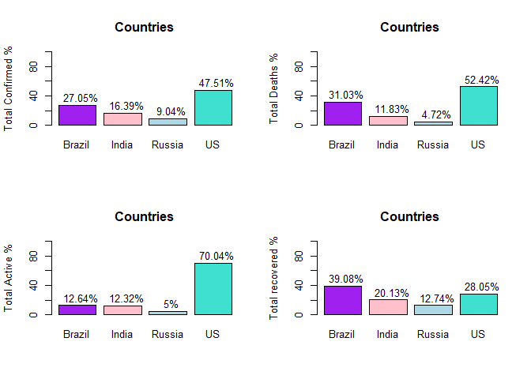
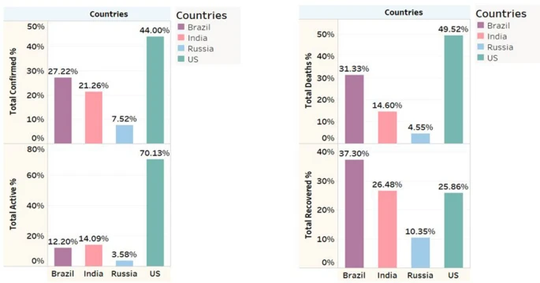
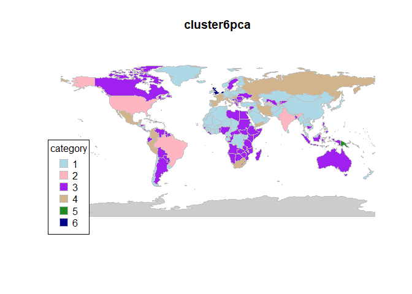
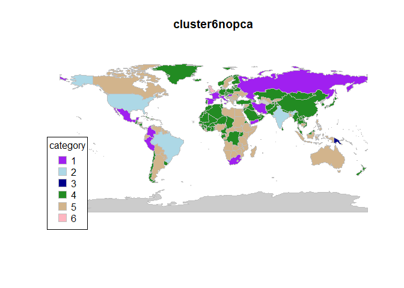
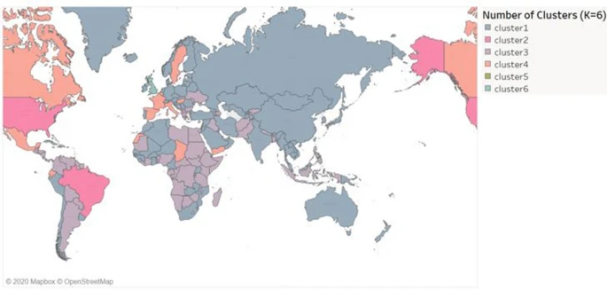
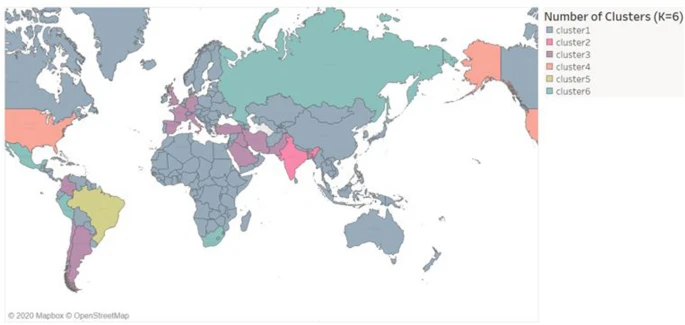

COVID-19 Severity Clustering
================
Emil Cacayan (ecacayan)
May 2, 2024

  

# Paper Description/Context

Many crises that arise in humanity follow an archetype of sorts:
solutions found for problems often come with scientific advance. One of
the most salient and recent crises to have occurred is the COVID-19
pandemic. The disease is emerged in Wuhan, China and was declared a
pandemic on March 11, 2020. Research exists on SARS-CoV-1, a related
virus, but this is relatively sparse compared to the research required
at the time to mount a response to SARS-CoV-2.

One of the main differences between the endemic caused by SARS-CoV-1 and
the COVID-19 pandemic is the renewed interest in machine learning -
while the theory for many machine learning methods have been around for
a long time, datasets were too small and the calculations required
hardware that simply did not exist at the time. With the dawn of cloud
computing, big data, and advances in parallel computing, machine
learning as a field experienced a renaissance, and became an important
tool in determining the current state of the pandemic, predicting how
the pandemic may change over time, and planning interventions to help
slow the spread the infection and improve patient outcomes of those
infected with the disease.

In a paper published 2021, researchers Chaudbary and Singh titled
[Community Detection Using Unsupervised Machine Learning Techniques on
COVID-19
Dataset](https://link.springer.com/article/10.1007/s13278-021-00734-2),
the authors hoped to use the unsupervised machine learning method,
K-means clustering, coupled with principal component analysis dimension
reduction in order to create clusters (communities) of countries
requiring special attention when implementing a response to the
pandemic. Previous studies on the pandemic were usually traditional
statistical analyses on exploratory and explanatory bivariate analysis
(at the time of the publication) and the topic of study often focused on
the end user (patient), such as metrics on biochemistry or pathology.

The authors of this paper wanted to create a more macroscopic analysis
of the epidemiology of COVID-19, but the results of this paper were not
intended to be clinical, but a proof of concept for the use of
clustering algorithms to find in this case countries that required
additional help for mounting a response to the pandemic, but for big
data in healthcare and epidemiology in general.

# Data Description

The dataset being analyzed was scraped from the [Johns Hopkins
Coronavirus Resource
Center](https://www.google.com/url?sa=t&rct=j&q=&esrc=s&source=web&cd=&cad=rja&uact=8&ved=2ahUKEwi61Lun6o2FAxWOg4kEHbWbBNkQFnoECBMQAQ&url=https%3A%2F%2Fcoronavirus.jhu.edu%2F&usg=AOvVaw2XXlwWV2IXFAT4DfMAVC3W&opi=89978449)
via a [scraping
tool](https://github.com/imdevskp/covid_19_jhu_data_web_scrap_and_cleaning)
obtained from GitHub. The scraping tool takes information from the
resource center and updates weekly with new data - some of the data
being accumulatory (a total that increases over the course of the
pandemic), others being updated weekly (such as percent change during
the week). The data consists of $n = 197$ countries across 15 variables,
where $p = 13$ are continuous and will be used for the bulk of the
analysis. Further information about the individual variables can be
found in Appendix B.1.

The dataset used in this paper contained the data collected on August
15th, 2020, and scraping began January 22, 2020. The data that was
updated weekly is represents those variables collected on August 15th
2020, and the accumulating variables accumulated from January 22, 2020
to August 15th, 2020. The scraper, however, stopped collecting data once
Johns Hopkins ended data collection on its surveillance feed on march
10, 2023, and so the dataset used in this analysis covers until March
10th, 2023. There is no way to obtain the historical data (unless the
authors are contacted directly), as the scraper replaced old data
without archiving.

The variables were renamed for ease of reference (Appendix B.2), and
cleaned so that NaN’s (which were not found) or infinite values (which
were set to 0) were no longer in the dataset.

# Project Aims/Goal (C)

The authors had one primary goal in this paper: to show K-means
clustering with PCA as a proof of concept for clustering countries into
different groups based on the metrics collected by the scraper. This
analysis seeks to further this goal by using the PCA to find which
variables are most important in terms of explaining the variance in the
dataset and elucidate reasons why the countries were clustered.

# Description of Analysis Methods Used (D)

The authors implemented two heuristics to analyze the dataset: PCA and
K-means clustering.

## Exploratory Analysis

First, the new dataset was compared to the dataset the authors used,
using the metrics they displayed in their analysis.

## PCA

PCA is a method by which you apply a linear transformation on the data
onto a new coordinate system in the directions capturing the highest
amount of variance. The authors used principal component analysis in
order to supplement their K-means clustering, and not as a method of
exploring the dataset in and of itself. They argued that reducing the
dimensions to make the clustering more discriminatory. The authors
selected the number of principal components that reached close to 1 as
possible. The clustering will be based on most of the information in the
dataset, and in doing so optimizes being more robust against noise and
keeping most of the information contained in the datset. Both PCA and
K-means clustering are robust against multicollinearity, since PCA
removes collinearity by creating axes with no correlation to each other
(orthogonal), and K-means clustering does not rely on any assumptions on
distribution.

Before performing the PCA, the authors standardized the dataset such
that the mean was 0 and the variance was 1. This was to ensure that
outliers have less influence on the PCA and clustering and so that
variables with large scales do not dominate the PCA axes.

## K-Means Clustering

The authors decided to use K-means clustering in order to cluster the
dataset. In this method, K (a hyperparameter) centroids are moved
through a dataset in order to reduce within sum of squares distances
from the points to the centroid. The main advantage of this clustering
method is that it is based on Euclidean distance to determine
observation similarity. While K-means is only suited to spherical
homogeneous clusters, PCA can help remove dimensions in the dataset to
make the variance structure of the dimension-reduced dataset more simple
and hopefully owe itself to the cluster structure generated by K-means
clustering.

# Results and Interpretations (E)

## Exploratory Analysis

We see in several of the metrics listed by the authors, proportionality
across different regions and countries were observed, with only minor
differences in percentage points. This was contained in the graphs
plotting the accumulating variables against other countries. More of
these graphs can be found in Appendix C, but a graph confirming metrics
against the four most affected countries (Brazil, India, Russia, and the
US) are shown here, note that the shapes of the graphs buy and large are
the same.

    ## [1] 9

<!-- -->

From the correlation matrix and pairs plot in appendix D.2, we see that
there are strong correlations between many of the variables. Some of the
variables are calculated from the others, but we see correlation
maintained through variables measuring completely different metrics,
such as `confirmed` or `deaths`. PCA actually relies on these
correlations and another assumption that they must be linearly
correlated. The pairs plot in appendix D.2 shows that there are many
variables that have a linear relationship. The only issue that might
arise is a problem with outliers, which is implied in the above graph.

From the scree plots generated in appendix D.3, the scree plot generated
by the authors and the one in this analysis shape-wise are very similar,
but the first principal component explains more variance in the new
analysis than the author’s, but not by a significant amount. This
principal component will later be associated with many of the
accumulating variables, and over time these variables became much
larger. The fact that this principal component increased by such a small
amount indicates that much of the information contained in this dataset
came from the time period measured by the authors and that there was not
much that changed since August 2020 to March 2023.

## PCA

From the scores, generated, we obtain the following conclusions about
the first three principal components (appendix D.4):

    ##                             PC1          PC2          PC3
    ## confirmed           0.348202063  0.008250631 -0.014515304
    ## deaths              0.326534205 -0.138776886 -0.117439206
    ## recovered           0.323924968  0.085634858 -0.025122470
    ## active              0.315298925 -0.052348772  0.004077809
    ## new.cases           0.336863912  0.040000517  0.056680943
    ## new.deaths          0.327493321  0.035037220  0.033446537
    ## new.recovered       0.325108596  0.080349429  0.044572203
    ## deaths100c          0.029483381 -0.497126101 -0.432901636
    ## recovered100c      -0.028699458  0.574966570 -0.419696775
    ## deaths100r          0.011310864 -0.580255168 -0.271589132
    ## confirmed.lastweek  0.345967513  0.002174557 -0.022653492
    ## one.week.diff       0.346183549  0.051104819  0.044199692
    ## one.week.pct.inc    0.002781496 -0.210433110  0.734339724

- **PC1**: The first principal component has correlations of around 0.3
  for many of the variables. This represents a direction of the
  variation that explores overall metrics of the COVID-19 pandemic. This
  also indicates that the variables `deaths100c`, `recovered100c`,
  `deaths100r`, and `one.week.pct.inc` are likely redundant in this
  case, which makes sense as these are variables that do not add any new
  information to the dataset (they are all calculated from the other
  variables). This principal component indicates that for a large
  proportion of the first major axis of variance, the variables are
  equally important in determining this variance.
- **PC2**: The second principal component has high positive correlations
  with those involved in patients recovering (that had near 0
  correlations in the previous principal component) and negative
  correlations involved in patients dying from COVID. It is interesting
  that the `deaths` variable has a lower magnitude of effect on this
  principal component than the previous, indicating that much of its
  variance correlates with the others in the direction of the first
  principal component. This principal component can be interpreted as a
  death/recovery axis.
- **PC3**: The third principal component has high correlations in
  `deaths100c`, `recovered100c`, `deaths100r`, and the
  `one.week.pct.inc` variables. The former 3 are negative, and the
  former is highly positive (and in this principal component, has the
  highest correlation magnitude). This principal component is somewhat
  difficult to interpret, but can be understood to be a percent change.
  Notice the latter 3 variables have to do with decreasing the number of
  cases of COVID-19 in the popualtion, and so of course these variables
  will be covariates in the opposite direction of `one.week.pct.inc`.

In appendix D.4, we also see an outlier from the US that may be causing
the skewing of the first principal component we observed. Removal of
this data point did not change the way the principal components were
distributed by much though, and a couple more outliers emerged from
this. Removing these will likely produce a similar result to removing
the US. It seems that some countries are more affected by the variables
associated with the overall pandemic state, while others are affected by
the death/recovery variable, and many more lie somewhere in between.

## K-Means Clustering

The optimal number of K was obtained by a combination of elbow blots
based on the within sum of squares distance, and average silhouette
width. From the within sum of squares distance, an optimal number around
6 or 7 was selected, but from the average silhouette width, the maximum
silhouette width was 2, which will be looked at later. The increase from
K = 1 to 2 in the within sum of squares distance plot corresponded to
the largest decrease in within sum of squares, likely a reason why the
silhouette width was significantly larger.

It is of note that K = 6 represents a local maximum for silhouette width
(2nd highest peak behind K = 2), while K = 7 represents a local minimum.
We should expect K = 7 to not add that much information in terms of the
clusters.

In appendix E.2, we see that in the maps generated, there is no
significant difference with/without PCA in the new dataset. But for K =
6, the authors noted that US and Brazil were clustered in one group
after PCA was applied, as they are closely related in terms of being
affected the most by the pandemic from domain knowledge. But from the
results obtained in the analysis, there seems to be no difference in the
clusterings with or without PCA. There is also very little difference
between K = 6 and K = 7 means clustering in this new analysis,
supporting the inference from the silhouette plot made earlier. The most
likely reason is that over time, the data could have become so different
that we don’t observe the author’s result anymore - the variance
stabilized such that applying PCA doesn’t make a difference in the
clustering. The same reason could be applied as to why little to no
difference could be made for K = 6 and K = 7 (new clusters were made for
only a few relatively small countries).

    ## 186 codes from your data successfully matched countries in the map
    ## 1 codes from your data failed to match with a country code in the map
    ## 57 codes from the map weren't represented in your data

<!-- -->

    ## 186 codes from your data successfully matched countries in the map
    ## 1 codes from your data failed to match with a country code in the map
    ## 57 codes from the map weren't represented in your data

<!-- -->

The first map below was the clusterings made by the authors with K = 6
with PCA. The second is without PCA K = 6.

When setting K = 2, we see the outliers that affected the clusterings
the most: USA, India, and Brazil. These countries likely affected the
clusterings the most, hence why the separation was so high indicated by
the silhouette plots.

# Final Conclusions and Further Analysis (F)

In conclusion, we arrive at the same result that K-means and PCA could
be a means of clustering the data. In addition, we created further
interpretations on the PCA that indicate pandemic severity and change in
death/recovery. The K-means clustering and PCA indicated that the new
data stabilized the covariance matrix such that applying PCA did not
change the clusters by much. Lastly, we see that outliers affected the
clustering significantly and could be found by setting K = 2, and the
degree of separation was extremely high for these outliers relative to
the rest of the dataset as indicated by the silhouette plot.

In terms of further analysis, it would be fruitful to explore other
clustering methods such as hierarchical clustering. With the additional
domain knowledge obtained over the course of the pandemic, perhaps we
know groupings for the countries and could use logistic regression, LDA,
or other regression techniques in order to predict the future state of a
country. Because K-means relies on random initial conditions, we could
cross-validate our K-means clustering in order to obtain a consensus
centroid location, or use a clustering method that has a closed-form
solution such as hierarchical clustering.
